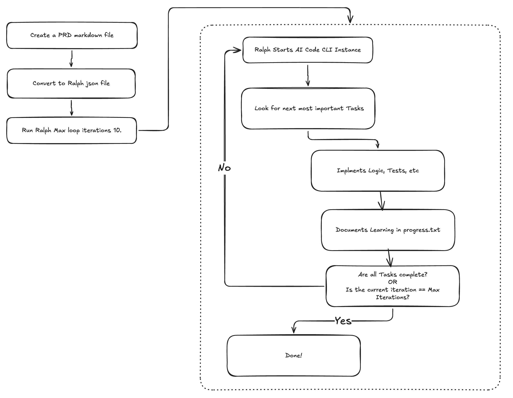

# Ralph Loop - Explained

## What is a Ralph Loop?

A Ralph Loop is a method of using an AI CLI tool (like Claude or GPT-4) to iteratively process tasks defined in a prompt file. The loop continues until the AI indicates that all tasks are complete or a maximum number of iterations is reached.

The Ralph loop alone is neat basic programming concept, but it can be combined with other tools and scripts to create powerful automation workflows.

```
bash
MAX_ITERATIONS=10
AI_TOOL_CMD="claude --dangerously-skip-permissions"

for i in $(seq 1 $MAX_ITERATIONS); do
  # Call AI CLI tool with prompt file and capture output and errors.
  OUTPUT=$(cat "$SCRIPT_DIR/prompt.md" | $AI_TOOL_CMD 2>&1 | tee /dev/stderr) || true
  
  # Is all tasks complete?
  if echo "$OUTPUT" | grep -q "<promise>COMPLETE</promise>"; then
    echo ""
    echo "Ralph completed all tasks!"
    exit 0
  fi
  
  echo "Iteration $i complete. Continuing..."
  sleep 2
done
```


## User Workflow



1. **Define PRD**: Using the PRD skill, create a detailed Product Requirements Document (PRD) that outlines the features and specifications of the desired application.

2. **Generate User Stories**: Utilize ralph skill to convert the PRD to json prd output to break down the PRD into manageable user stories that capture the functionality from an end-user perspective.

3. **Run the Loop**: Execute the Ralph Loop script, which will process the user stories iteratively. The AI will generate code snippets, configurations, and other necessary components based on the user stories.

4. **Review and Refine**: After each iteration, review the output generated by the AI. Make any necessary adjustments to the prompt file or user stories to ensure the generated code meets the desired specifications. Then you can start start the process again, continue till you are out of features.


## First Time Setup
1. **Clone the Repository**: Start by cloning the Ralph Loop repository to your local machine.
2. **Copy scripts/ralph Folder**: Copy the `scripts/ralph` folder from the cloned repository to your project directory where you want to run the Ralph Loop.
3. **Install AI Skills**: Ensure you have the PRD and ralph skills installed and accessible in your environment. Check your AI cli tool documentation for skill installation instructions. However most of the time this would be in your project folder under .github/skills or .claude/skills

```bash
./scripts/ralph/install.sh
```


## Manual Setup Steps

1. **Install AI CLI Tool**: Ensure you have an AI CLI tool like Claude or GPT-4 installed and configured on your system.
2. **Install AI Skills**: Make sure you have the PRD and ralph skills installed and accessible in your environment. Check your AI cli tool documentation for skill installation instructions. However most of the time this would be in your project folder under .github/skills or .claude/skills
3. **Configure Script**: Update the `AI_TOOL_CMD` variable in the Ralph Loop script to match your AI CLI tool command. For example, if using Claude, it might be `claude --dangerously-skip-permissions`.
4. **Copy Ralph Files**: Copy the Ralph Loop script and prompt file into your project directory where you want to run the loop.
5. **Set Permissions**: Ensure the Ralph Loop script has execute permissions. You can set this using the command:
   ```bash
   chmod +x path/to/ralph.sh
   ``` 
6. Done.

